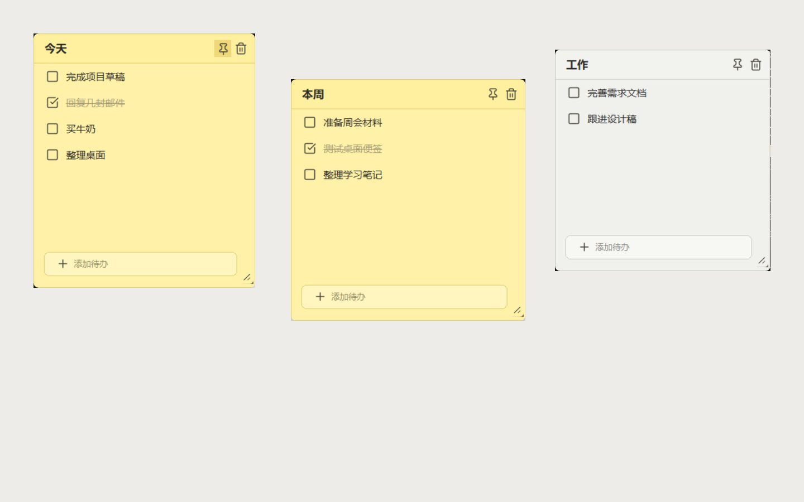

# My Sticky Notes

一个本地优先、Todo 导向的极简 Windows 桌面便签。支持多张便签、置顶、通知区域托管、开机自启和 JSON 持久化，不需要账号、联网或后台服务。



## 功能

- 多张淡黄或黯白便签，默认出现在主屏工作区右上角。
- Todo 添加、编辑、完成和删除；已完成事项淡化并划线。
- 每张便签可独立置顶，位置和尺寸自动保存。
- 便签不占用任务栏；通知区域图标负责新建、设置、自启和退出。
- 设置窗口打开时才显示任务栏入口。
- 单实例运行，重复启动会唤起现有实例。
- 数据完全保存在本机，并保留最近一份备份。

## 安装与启动

支持 Windows 10 和 Windows 11。请在仓库的 Releases 页面下载唯一的安装包：

```text
My Sticky Notes Setup <版本>.exe
```

安装程序默认使用当前用户目录，不需要管理员权限，也可在安装向导中修改位置：

```text
%LOCALAPPDATA%\Programs\MyStickyNotes
```

安装完成后，可勾选“启动 My Sticky Notes”，或从开始菜单搜索“My Sticky Notes”。应用运行后常驻通知区域；关闭设置窗口不会退出，完全退出请使用通知区域菜单中的“退出应用”。

> 当前公开安装包未进行商业代码签名。Windows SmartScreen 可能显示“未知发布者”提示，请只从本仓库 Releases 下载并核对 `SHA256SUMS.txt`。

## 设置

- 开机时自动启动。
- 新建便签颜色：`淡黄` 或 `黯白`。
- 新建便签是否默认置顶。

所有设置即时保存。开机启动使用当前用户的 Windows `Run` 注册表项，不需要管理员权限。

## 数据与隐私

状态保存在：

```text
%LOCALAPPDATA%\MyStickyNotes\state.json
```

标题、Todo、完成状态、颜色、置顶状态、窗口位置和尺寸都会保存。写入使用临时文件原子替换，并保留最近一份备份。卸载程序默认保留便签数据。

应用不需要账号，不收集遥测，也不会主动联网。`MY_STICKY_NOTES_DATA_DIR` 环境变量可显式覆盖数据目录。

## 从源码运行

需要 Python 3.11 或 3.12，以及 Python 自带的 tkinter。建议使用项目虚拟环境：

```powershell
py -3.12 -m venv .venv
.\.venv\Scripts\Activate.ps1
python app.py
```

项目运行时没有第三方 Python 依赖。

## 测试

单元测试不需要额外依赖。运行涉及屏幕截图的桌面回归前，先安装开发依赖：

```powershell
python -m pip install ".[dev]"
```

```powershell
python -m unittest discover -v
python scripts\ui_smoke_test.py
python scripts\desktop_behavior_regression.py
```

后两项会在 Windows 桌面短暂打开测试窗口。

## 构建安装包

内部载荷使用 PyInstaller 文件夹模式，再由 NSIS 封装为唯一发布安装包。首次构建会把固定版本的构建工具缓存到 `.build-tools`：

```powershell
powershell -ExecutionPolicy Bypass -File .\build.ps1 -Python python
```

输出位于 `release`：

```text
My Sticky Notes Setup 0.1.0.exe
SHA256SUMS.txt
```

推送与应用版本匹配的标签（例如 `v0.1.0`）后，GitHub Actions 会运行测试、构建安装包并创建 GitHub Release。

## 贡献与安全

贡献方式见 [CONTRIBUTING.md](CONTRIBUTING.md)，安全问题报告方式见 [SECURITY.md](SECURITY.md)。版本变化记录在 [CHANGELOG.md](CHANGELOG.md)。

## 许可证

项目使用 [MIT License](LICENSE)。图标资源的第三方许可见 [assets/icons/LICENSE-lucide.txt](assets/icons/LICENSE-lucide.txt)。
